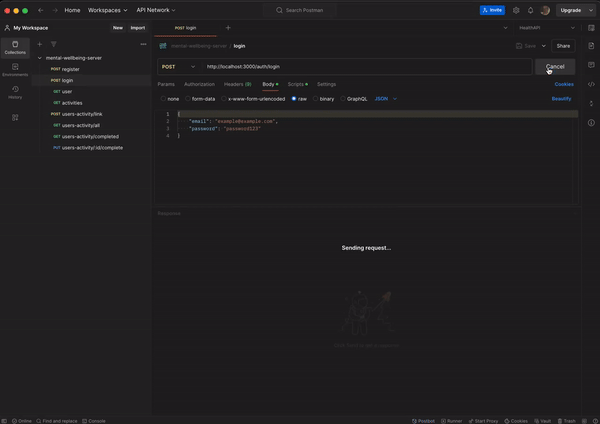

# Mental Wellbeing App

This project is a NestJS-based API for managing users and their activities. It includes authentication JWT.

## File Structure

```css
src/
├── auth/
│ ├── auth.controller.spec.ts
│ ├── auth.controller.ts
│ ├── auth.module.ts
│ ├── auth.service.spec.ts
│ ├── auth.service.ts
│ ├── jwt-auth.guard.ts
│ └── jwt.strategy.ts
├── activity/
│ ├── dto/
│ │ └── activity.dto.ts
│ ├── activity.controller.spec.ts
│ ├── activity.controller.ts
│ ├── activity.enum.ts
│ ├── activity.entity.ts
│ ├── activity.module.ts
│ ├── activity.service.spec.ts
│ ├── activity.service.ts
├── database/
│ ├── migrations/
│ │ └── 1716166990354-base.ts
│ └── seeders/
│ │ └── activity.seeder.ts
├── interceptor/
│ ├── exceptions.ts
│ ├── exception.interceptor.ts
│ ├── interceptor.module.ts
│ └── transform.interceptor.ts
├── user/
│ ├── dto/
│ │ └── user.dto.ts
│ ├── user.controller.spec.ts
│ ├── user.controller.ts
│ ├── user.decorator.ts
│ ├── user.entity.ts
│ ├── user.module.ts
│ ├── user.service.spec.ts
│ └── user.service.ts
├── users-activity/
│ ├── dto/
│ │ └── users-activity.dto.ts
│ ├── users-activity.controller.spec.ts
│ ├── users-activity.controller.ts
│ ├── users-activity.entity.ts
│ ├── users-activity.module.ts
│ ├── users-activity.service.spec.ts
│ └── users-activity.service.ts
├── app.controller.spec.ts
├── app.controller.ts
├── app.module.ts
├── app.service.ts
└── main.ts
```

### Explanation of the Layers

- **Feature Module Layer**:
   - Contains module, controller, service and it's own dtos

- **Database Module Layer**:
   - contains migrations and seeders 

- **Interceptor Module Layer**:
   - contains exception and response interceptors and it's types  

- **Auth Module Layer**:
   - contains JWT setup and it's own controllers and services

## Getting Started

### Prerequisites

- [nvm](https://github.com/nvm-sh/nvm)
- [docker](https://docs.docker.com/engine/install/)

## Running the App

1. Clone Repo

```fish
git clone https://github.com/misaelriojasftf/mental-wellbeing-app.git
cd mental-wellbeing-app
```

2. Install Dependencies

(!) only if you don't have installed 3.22.0 yet

```bash
nvm install 22.2.0
```

and

```fish

nvm use
npm i 
```

3. Configure environment

Create a .env file in the root directory taking the [env.example](/.env.example) and overwrite with your env settings

```bash
DATABASE_HOST=localhost
DATABASE_PORT=5432
.
.
.

```

Create a orm config file in the root directory taking the [orm.config.example](/orm.config.example.ts) and overwrite with your env settings

```bash
export const connectionSource = new DataSource({
    migrationsTableName: 'migrations',
.
.
.

```

4. Run Seeders

```bash
npm run seed:activities
```

4. Run Project

In Dev Mode
```bash
docker-compose up -d
npm run start:dev
```

In Debug Mode
```bash
docker-compose up -d
npm run start:debug
```

## How to Test

download the [postman collection](/docs/mental-wellbeing-app.postman_collection.json) and import it


